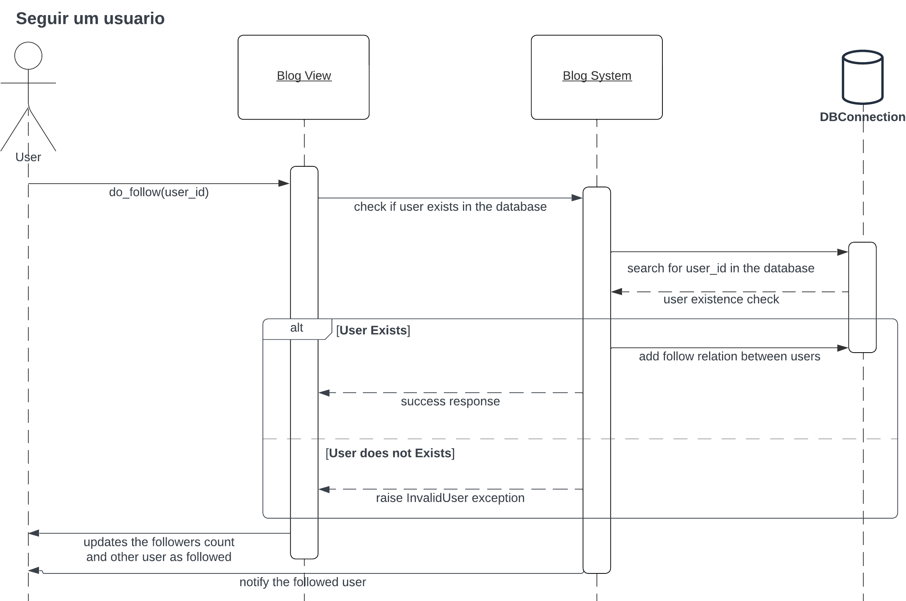
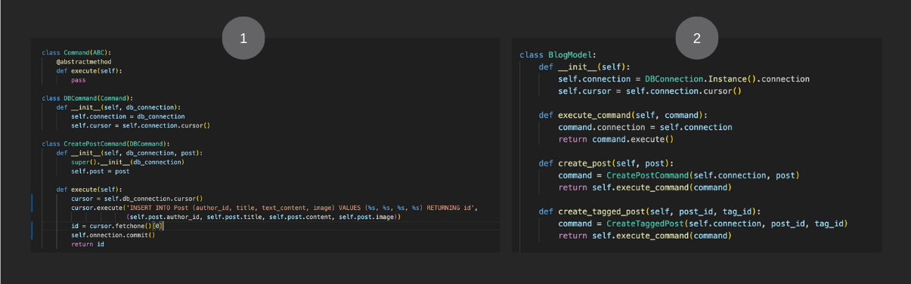

# Bloggster
Sistema de blogs e publicação de conteúdo desenvolvido para a disciplina de Engenharia de Software - 2023.2, na FGV EMAp

- Ana Carolina Erthal Fernandes 
- Cristiano Júnior Larrea Leal
- Guilherme Gonçalves de Melo
- Felipe Marques Esteves Lamarca
- Paloma Vieira Borges

## Planejamento, Análise e Design do Sistema

A etapa de planejamento, análise e design do sistema encontra-se escrita abaixo.

### Diagram de caso de uso

Na seção abaixo, apresentamos os documentos referente ao planejamento da sistema. 
> Reiteramos que a entrega da A1 foi refeita. A entrega da A1 pode ser encontrada [initial-project.pdf](initial-project.pdf).


### Caos de Uso e Histórias de usuário

Os casos de uso e as histórias de usuário encontram-se [nesse documento](docs/planejamento-sistema.pdf).

### Diagrama de classes


### Diagramas de Sequência

Os diagramas de sequência para as principais funcionalidades estão presentes no folder [sequences-diagram](./docs/sequences-diagram/). Abaixo, também apresentamos as imagens.

#### Criar um post


#### Curtir um post


#### Seguir um usuário


#### Criar um comentário


#### Filtrar por Tag


## Desenvolvimento

### Demo
O vídeo demo da aplicação funcionando podem ser encontrado [aqui](https://drive.google.com/file/d/1HLhy0SrlRKPupGwsFLUQEkL-UdhIl3UQ/view?usp=sharing).

### Interface
A biblioteca utilizada foi o [CherryPy](https://docs.cherrypy.dev/en/latest/), um framework da web usado para criar aplicativos da web. Sua escolha foi devido a facilidade de mapear URL`s a funções.

### Banco de Dados
O banco de dados utilizado foi um PostgreSQL as a Service, o [ElephantSQL](https://www.elephantsql.com/). Essa escolha foi feita para facilitar a conexão por todos do grupo, pois não teriam que criar bancos locais cada um. Entretanto, em caso de necessidade, pode-se criar um banco local com o [script SQL de criação do banco](./docs/create_database.sql).

> Atenção: esse banco possui o limite de até 5 conexões simultâneas (por causa da gratuidade do plano). Caso, ao rodar o programa, receba o erro de  `'psycopg2.OperationalError: connection to server at "isabelle.db.elephantsql.com" (52.67.27.11), port 5432 failed: FATAL:  too many connections for role "wxishrvi"`, é sinal de que o limite de conexões simultâneas foi atingido.

### Padrões de Projeto
Para este projeto, foram utilizados 6 padrões de projeto: Observer, Command, Singleton, Decorator, Factory e State.

#### Observer
Para notificar um usuário quando este é seguido, foi utilizado o padrão Observer. Para isso, no módulo `event.py` foi criado a classe de eventos que estão inscritos nesse padrão, assim como suas funções (o que deve acontecer ao esse evento ocorrer). No módulo `followListener.py` estão as configurações do nosso evento (imagem 2) e a implementação da nossa função. Por fim, no módulo onde acontece a ação de *follow*, `users.py`, foi feita a configuração inicial e, na função de *follow*, foi adicionado o trigger para o disparo do evento.


> Observação: para ser mais fácil de testar e não termos que configurar conexões com servidores de email e etc., a lógica de enviar a notificação foi abstraída para um print no terminal, conforme observado na função `handle_follow_event()`.

#### Command
Esse padrão foi utilizado para as queries no banco de dados. Para isso, cada query foi modelada como um comando, conforme demonstrado na figura 1. Por fim, nossa camada de *model* cumpre o papel de *invoker* deste padrão, invocando esses comandos. 



#### Singleton e Decorator
Para assegurar que todas conexões com o banco utilizadas na aplicação são as mesmas, utilizamos o padrão Singleton. Junto com ele, utilizamos a *sugar syntax* do Python para o design do decorator - isto é, um decorador para modificar o comportamento da classe `DBConnection`.


#### Factory
No momento do login, é verificado se o usuário é um moderador ou um usuário normal. O padrão Factory foi utilizado para a criação dos nossos dois tipos de usuário após essa verificação: User (usuário normal da aplicação) e Moderator (moderador com atribuições a mais). 


Como são apenas 2 usuários, nesse primeiro momento não parece haver tanto sentido em utilizá-lo. Entretanto, pensando em manutenabilidade da aplicação, caso no futuro sejam criados novos tipos de usuário (criador de conteúdo, empresa, etc), esse padrão já esta aplicado para facilitar.

#### State
Esse padrão foi utilizado para gerenciar a sessão do usuário na aplicação. O modulo `state.py` implementa a classe abstrata dos states (figura 1).  Na classe referente ao usuário (2), foram implementadas a propriedade e os métodos referente ao padrão do projeto. Por fim, na funcão de autenticação, foi mudado o seu estado de padrão (deslogado) para logado após o login e para acessar as outras páginas da aplicação (4) é verificado se este está sempre logado. Além disso, ao clicar em Logout, então seu estado é mudado também.


## Run
Para rodar a aplicação, deve-se rodar o comando
```
python src/controller.py
```


## Teste e Qualidade de Software

Para esta aplicação foram feitos testes unitários e testes de integração (especificamente, de integração com o banco de dados).
Para os de integração, foi setado a conexão para um banco de dados local afim de simular um *mock*.
Os testes podem ser encontrados no folder `tests` e podem ser rodados primeiramente entrando na pasta `tests`
```
cd tests
```
e depois, rodando
```
python <arquivo_de_teste.py>
```
